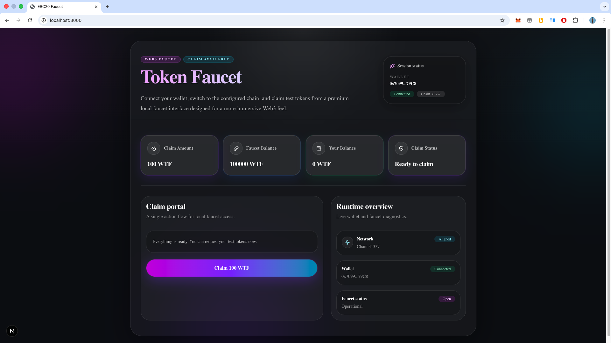
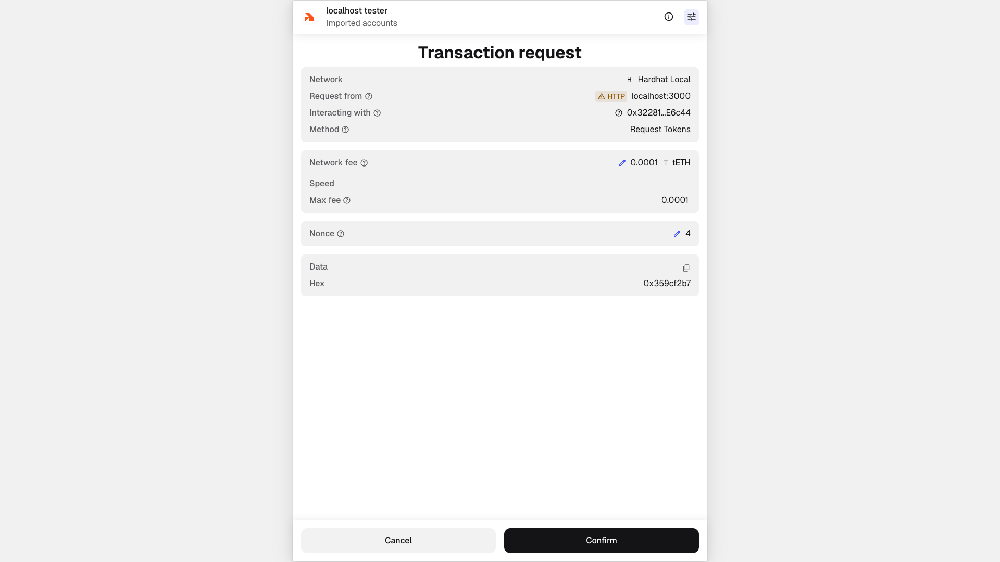
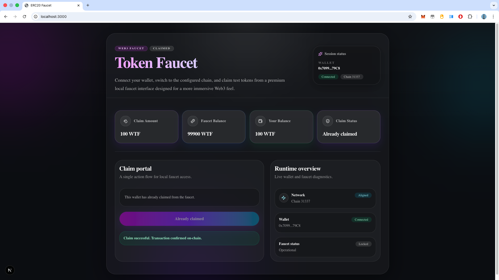

# ERC20 Faucet DApp

A local full-stack ERC20 faucet demo built with **Hardhat + Ignition + Next.js + wagmi**.

This project lets a user connect a wallet, switch to the local Hardhat network, and claim free ERC20 test tokens from a faucet contract.

---

<p align="center">
  
  
  
</p>

<p align="center">
  
</p>

## Features

- Deploys a local ERC20 token contract
- Deploys a faucet contract funded with ERC20 tokens
- Exports deployed contract addresses and ABIs for the frontend
- Connect wallet from the browser
- Detect wrong chain and prompt network switching
- Claim faucet tokens once per wallet
- Display:
  - claim amount
  - faucet balance
  - user balance
  - claim status
  - network status

---

## Project Structure

```text
erc20-faucet-dapp/
├── generated/                  # exported frontend-consumable contract data
│   ├── contracts.ts
│   └── deployment.meta.json
├── hardhat/                    # smart contracts + deployment
│   ├── contracts/
│   │   ├── MyToken.sol
│   │   └── TokenFaucet.sol
│   ├── ignition/
│   │   ├── modules/
│   │   │   └── Faucet.ts
│   │   ├── parameters.json
│   │   └── deployments/
│   ├── scripts/
│   │   └── deploy.ts
│   ├── tools/
│   │   └── export/
│   └── hardhat.config.ts
├── web/                        # Next.js frontend
│   ├── src/
│   │   ├── app/
│   │   ├── components/
│   │   ├── hooks/
│   │   ├── lib/
│   │   ├── providers/
│   │   └── types/
│   └── package.json
├── qa/                         # verification / test utilities
└── docs/                       # screenshots / test notes

```

## Architecture

### Smart contract layer (hardhat/)

This layer contains:

- MyToken.sol
  - A simple ERC20 token used by the faucet.
- TokenFaucet.sol
  - A faucet contract that lets a wallet claim tokens.
- ignition/modules/Faucet.ts
  - Hardhat Ignition deployment module.
  - It deploys:
  1. the ERC20 token
  2. the faucet
  3. funds the faucet with tokens
- scripts/deploy.ts
  - Runs the deployment and exports contract metadata for the frontend.
- tools/export/
  - Shared export utilities that generate:
- generated/contracts.ts
- generated/deployment.meta.json

⸻

### Frontend layer (web/)

This layer contains the Next.js app.

Main frontend responsibilities:

- connect wallet
- switch to the expected chain
- read contract state
- send claim transaction
- render faucet status UI

Important frontend files:

- src/lib/contracts.ts
  Imports contract addresses / ABIs from root generated/
- src/lib/wagmi.ts
  wagmi configuration for the local Hardhat network
- src/hooks/useWallet.ts
  Wallet connection and network switching logic
- src/hooks/useFaucetState.ts
  Reads token / faucet state from contracts
- src/hooks/useClaimToken.ts
  Sends the faucet claim transaction

⸻

## How It Works

1. Start a local Hardhat blockchain node
2. Deploy contracts to that local chain
3. Export addresses + ABIs into generated/
4. Start the Next.js app
5. Open the app in the browser
6. Connect wallet
7. Switch to local chain if needed
8. Claim faucet tokens

⸻

## Requirements

- Node.js 18+ recommended
- npm
- MetaMask or another injected browser wallet

⸻

## Install Dependencies

1. Install Hardhat dependencies

```
cd hardhat
npm install
```

2. Install frontend dependencies

```
cd ../web
npm install
```

⸻

## Running the Project

You will usually need 2 terminals.

In practice:

- Terminal 1 → run the local Hardhat node
- Terminal 2 → deploy contracts, then start the Next.js frontend

⸻

### Terminal 1 — Start Local Hardhat Node

From the hardhat/ directory:

```
cd hardhat
npx hardhat node
```

This starts the local blockchain, usually on:

http://127.0.0.1:8545

Keep this terminal running.

⸻

### Terminal 2 — Deploy Contracts

Open another terminal and run:

```
cd hardhat
IGNITION_FRESH=1 npx hardhat run scripts/deploy.ts --network localhost

```

Why IGNITION_FRESH=1?

This project is often used with a local Hardhat node that gets restarted frequently.

When the local chain is restarted, previous chain state is wiped.
Using:

IGNITION_FRESH=1

forces a fresh deployment flow so the exported contract addresses always match the currently running local node.

This prevents frontend issues caused by stale deployment records.

After deployment, the script exports new contract metadata to:

/generated/contracts.ts
/generated/deployment.meta.json

⸻

### Start the Frontend

After deployment finishes, still in Terminal 2:

```
cd ../web
npm run dev
```

Then open:

http://localhost:3000

⸻

### Typical Local Workflow

Every time you restart the Hardhat node, use this order:

Terminal 1

```
cd hardhat
npx hardhat node
```

Terminal 2

```
cd hardhat
IGNITION_FRESH=1 npx hardhat run scripts/deploy.ts --network localhost
cd ../web
npm run dev
```

⸻

## Wallet Setup

To use the app from the browser:

1. Open MetaMask
2. Add / switch to the local Hardhat network
3. Import one of the Hardhat test accounts if needed
4. Open the app and connect wallet

Local Hardhat chain details are usually:

- RPC URL: http://127.0.0.1:8545
- Chain ID: 31337
- Currency Symbol: ETH

You can use one of the private keys printed by npx hardhat node to import a local test wallet into MetaMask.

⸻

### Claim Flow

Once the app is running:

1. Click Connect wallet
2. If on the wrong chain, click Switch network
3. Click Claim
4. Confirm the transaction in the wallet
5. The UI will update with:

- your token balance
- faucet balance
- claimed status

⸻

## Notes

- This project is intended for local development and testing
- The exported contract data in generated/ is consumed by the frontend
- If you restart the node, you should deploy again before using the frontend
- The frontend reads from the latest generated contract data

⸻

## Useful Commands

### Compile contracts

```
cd hardhat
npx hardhat compile
```

### Start local chain

```
cd hardhat
npx hardhat node
```

### Fresh deploy to local chain

```
cd hardhat
IGNITION_FRESH=1 npx hardhat run scripts/deploy.ts --network localhost
```

### Start frontend

```
cd web
npm run dev
```

⸻

## Development Notes

This project separates responsibilities clearly:

- hardhat/ handles blockchain logic
- generated/ bridges deployment output to the frontend
- web/ handles UI, wallet connection, contract reads, and contract writes

That makes it easy to:

- redeploy locally
- export new contract metadata
- keep frontend and contracts in sync

⸻

## Future Improvements

Possible next steps:

- add toast notifications
- add claim history
- add admin refill function
- add multi-network deployment support
- add unit / integration tests for faucet flow
- add production deployment pipeline

⸻
